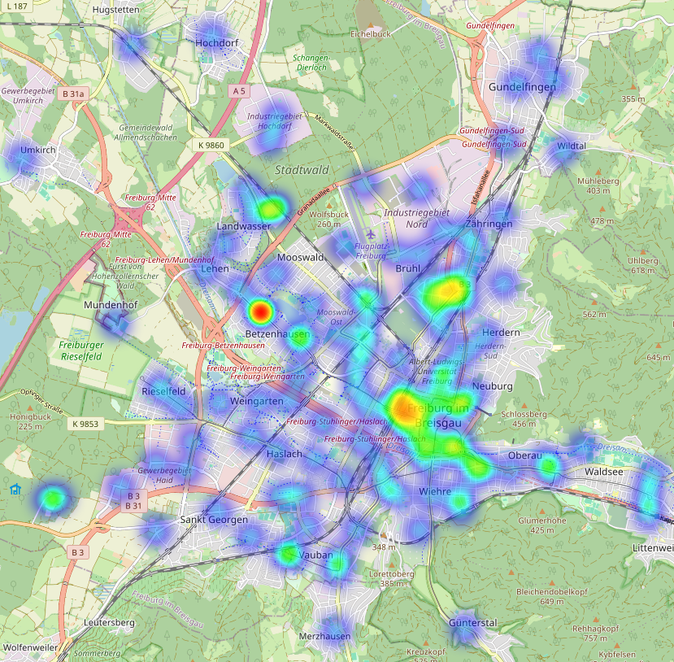
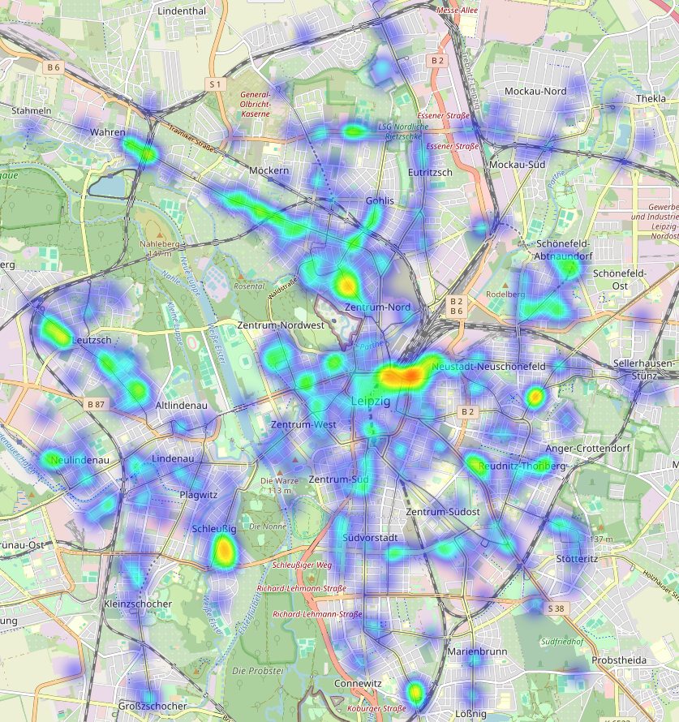

# NextBike API

Interact with the Nextbike API and fetch real-time bike-sharing data for various countries, organizations, cities, stations, and bikes.
The data is processed and organized into data classes, making it easy to work with and log the data to files for further analysis.

## Examples

This package can easily used to visualize bike-distributions across different cities:




## Installation

You can run from the terminal:

```bash
pip install git+https://github.com/sIDsID11/nextbike
```

## Basic Usage

### Setup

Import the `Client` class and create an instance of it.

```python
from nextbike import Client
c = Client()
```

### Direct access

Fetch the latest data from the Nextbike API into the client.

```python
c.fetch()
```

Access the data using the available methods.

```python
de = c.country("de")
frelo = c.organization("Frelo Freiburg")
freiburg = c.city(619)
messe_uni = c.station(15430457)
bike = c.bike(32928)
```

### Scraping

Scrape data at regular intervals into JSON files.

```python
c.scrape(interval_secs=5 * 60, 
        country_codes=["de"],
        organization_names=["Frelo Freiburg"],
        city_ids=[619],
        station_ids=[15430457],
        bike_ids=[32928])
```

Load data from stored JSON files later on for further analysis.

```python
country = c.load_country("file_path")
organization = c.load_organization("file_path")
city = c.load_city("file_path")
station = c.load_station("file_path")
bike = c.load_bike("file_path")
```

### Visualization

Visualize a country, organization or city.

```python
country = Country(...)
heatmap(country)  # Creates an html file of the heatmap

city = City(...)
bikemap(city)  # Creates an html file of the bikemap
```
